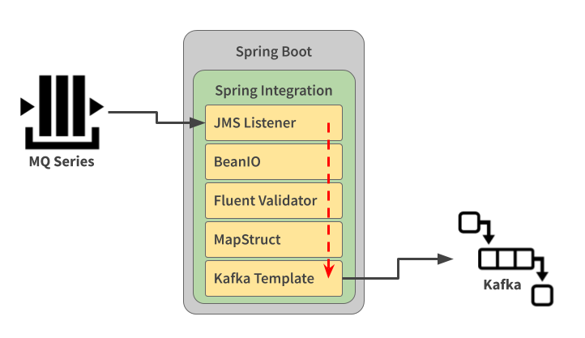
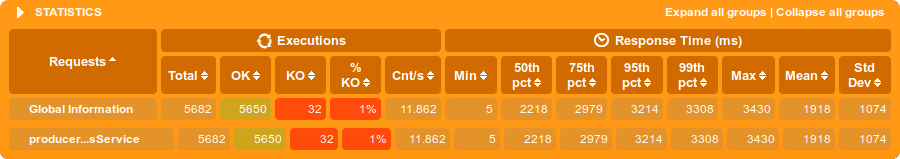
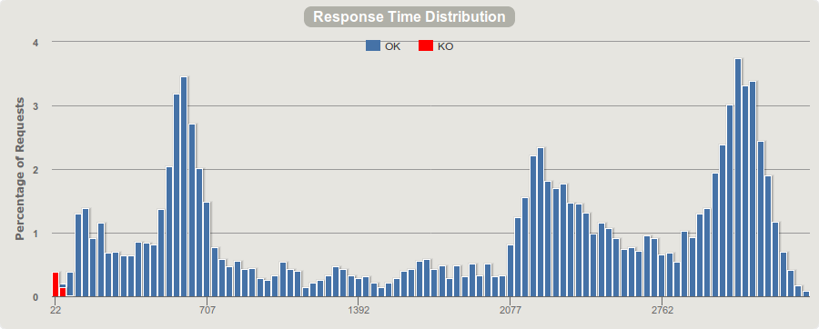
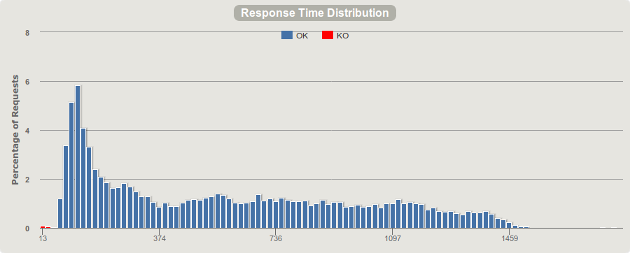
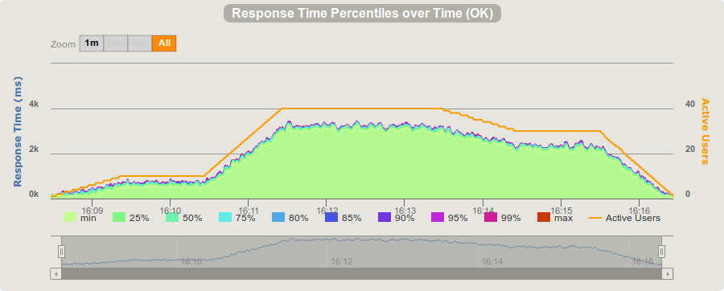
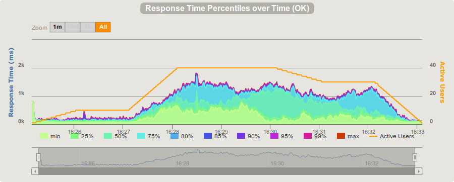
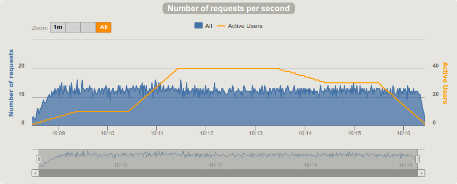
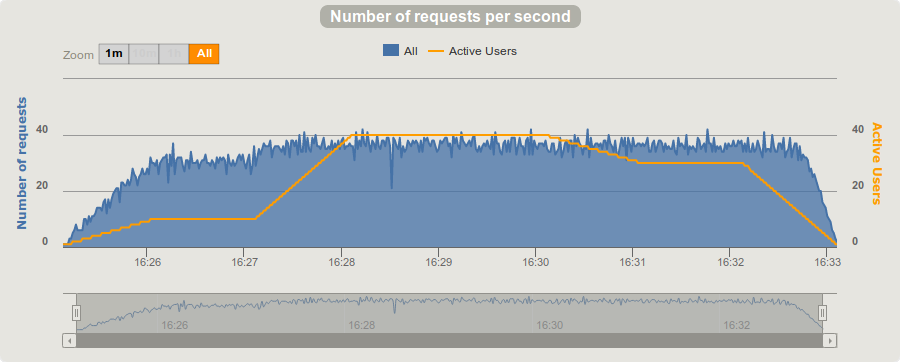
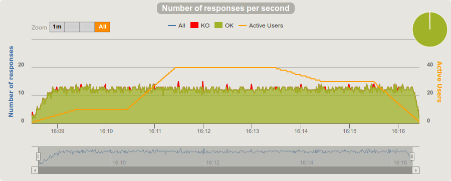
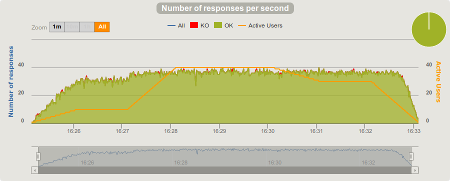

# Kafka Consumer Groups Load tests

## Release Notes

* **2019-09-28**: First version, all working just fine, but documentation :smile: 
* **2019-10-01**: This documentation
* **2019-10-03**: Consumer integration tests with embedded kafka, activemq and mock schema registry

# Study Case

## The Scenario

In a recent case (september/2019) I helped to analise a scenario where an application, responsible to "transform some data", had to be a simple but powerfull ETL (Extract, transform, load), from a message as fixed lenth fields to a metadata JSON (validated).

To test this scenario, I "borrowed" another project I just made (https://github.com/ricardo-comar/kafka-balanced-consumers) to simplify the tests, acting as a "producer" and response time analyser. 

The producer has an endpoint REST, to receive a request, transform into a Message, send to a Inbound queue in ActiveMQ, and keep the request alive until other message came from the Kafka topic, to reply the response.



A request controll was done, by using a custom header with a UUID  identifying the request, and replyed also on a custom header inside the response, to release the REST lock and replying it.

## Simulating 

* **Kafka + Zookeeper Cluster (main folder)**: The cluster was made by a docker-compose yaml, providing 3 instances together with 3 zookeeper instances.
* **ActiveMQ (main folder)**: Also provided by the docker-compose
* **Schema Registry (main folder)**: Also provided by the docker-compose
* **Splunk Enterprise (main folder)**: Also provided by the docker-compose, acessible by http://localhost:8000/en-US/. With it you can track the request lifecicle filtering by the correlation-id.
* **Load Balancer (border-service)**: A simple Spring Boot instance, set up to provide a load balance with zool, eureka and Hystrix.
* **Producer (kafka-producer)**: The Producer instance, provided by Spring Boot Web with two endpoints. The first receives a message with this payload below, and answers a HTTP 200 payload on success:
```
{ 
    "id": "ABC", //Unique ID for each request
    "payload": "Team ABC  Jown        Snow      Boss           1200010   26092009ACTIVE    " // Sample payload
}
```
```
{
    "id": "ABC",
    "response": { ... }, // Payload parsed as a metadata structure 
    "duration": 148 //Total Processing Spent time  
}
```
* **Consumer (kafka-consumer)**: The Producer instance, provided by Spring Boot Batch with a consumer connected to *ActiveMQ* to receive the request payload, translate and reply to outbound topic (topicOutbound)

* **Load Test (main folder)**: [load test]src/test/scala/producer/ProducerLoadTest.scala#L9) using [Gatling](https://gatling.io/), a very powerfull, flexible and light tool, with the desired scenarios and simultaneous users.


## Final Results

* **Analisys**: As observed on the results below, the *Concurrent Consumer Instances*  approach had a better throughput and processing distribution time:
* Statistics
  * Single Consumer  

  * Concurrent Consumers  


* Response Time Distribution
  * Single Consumer  

  * Concurrent Consumers  


* Response Time Percentiles over Time
  * Single Consumer  

  * Concurrent Consumers  


* Requests Per Second
  * Single Consumer  

  * Concurrent Consumers  


* Responses Per Second
  * Single Consumer  

  * Concurrent Consumers  


# Let's Play !!

Now you will be able to run a local test :smile:

## Setting up the outside resources

### Kafka cluster and topics creation

First, start the resources with docker-compose:
```
docker-compose up
```

You should see a lot of messages, related to the first time instances creation and running. 

At end they should be all running. You can list the services using "docker-compose ps" and see all of them with "Up" in Status collumn.

Now we need to identify the zookeeper leader instance. Connect with telnet to the first zookeeper instance (port 12181) and send the command "stats". If it's not the leader, it will reply with "Mode: follower".  Try the next port (22181 or 31181) until you receive a "Mode: leader".

In my example I'll pick the first instance (port 12181) as the leader, and will connect to it with "docker exec -it 76da9a64dd03 /bin/bash", to setup the topics. Then, send this command to list the available topics: 

```
kafka-topics --zookeeper zookeeper-1:12181 --list
```
Now you should see only two topics, used by kafka to keep things running. You can check their information by asking to describe them:
```
kafka-topics --zookeeper zookeeper-1:12181 --describe 
```
Now, let's create our topic:
```
kafka-topics --zookeeper zookeeper-1:12181 --create --topic topicInbound --partitions 6 --replication-factor 3
```
And now check if it was created as expected:
```
kafka-topics --zookeeper zookeeper-1:12181 --describe
```
Obs: If, for some reason, you want to recreate the topic, first you need to delete it:
```
kafka-topics --zookeeper zookeeper-1:12181 --delete --topic topicInbound
```

## Running all together

### Starting Resources 

As described above, run "docker-compose up" on main folder.


### Starting Load Balancer

On folder "etl-border-service", start the service with "mvn spring-boot:run"
You can check in your brownser if it's running by openning http://localhost:8080/


### Starting Producers

On folder "etl-producer", start the service with "mvn spring-boot:run". 

After a few seconds, you can check if it's registred on Eureka by opening in your browser http://localhost:8080/eureka/apps

You can also check if it is available on load balancer by opening http://localhost:8080/app/producer/actuator/health


### Starting Consumers

On folder "kafka-consumer", start the service with "mvn spring-boot:run". It's recomended to start more than one instance of it. 

### Final check

On your browser open a tab to Swagger interface:
* http://localhost:8080/app/producer/swagger-ui.html

### Running a Performance Test

Now, in another terminal, on main folder you can start the load tests by running "mvn gatling:run".

You will be able to monitor the progress, with a few informations about the success of the requests (or failures).

At the end a report will be generated, accessible by the provided path.

## References

* https://better-coding.com/building-apache-kafka-cluster-using-docker-compose-and-virtualbox/
* https://spring.io/guides/gs/rest-service/
* https://github.com/edenhill/kafkacat
* https://www.baeldung.com/spring-kafka
* https://docs.spring.io/spring-kafka/reference/html/#kafka
* https://dzone.com/articles/20-best-practices-for-working-with-apache-kafka-at
* https://www.baeldung.com/java-concurrent-locks
* https://cloud.spring.io/spring-cloud-netflix/multi/multi__router_and_filter_zuul.html
* https://www.baeldung.com/spring-cloud-netflix-eureka
* https://www.baeldung.com/zuul-load-balancing
* https://www.treinaweb.com.br/blog/documentando-uma-api-spring-boot-com-o-swagger/
* http://dev.splunk.com/view/splunk-logging-java/SP-CAAAE3R
* https://github.com/simplesteph/kafka-stack-docker-compose
* https://www.confluent.io/blog/schema-registry-avro-in-spring-boot-application-tutorial
* https://msayag.github.io/Kafka/
* https://memorynotfound.com/spring-kafka-adding-custom-header-kafka-message-example/
* https://developer.ibm.com/tutorials/mq-jms-application-development-with-spring-boot/
